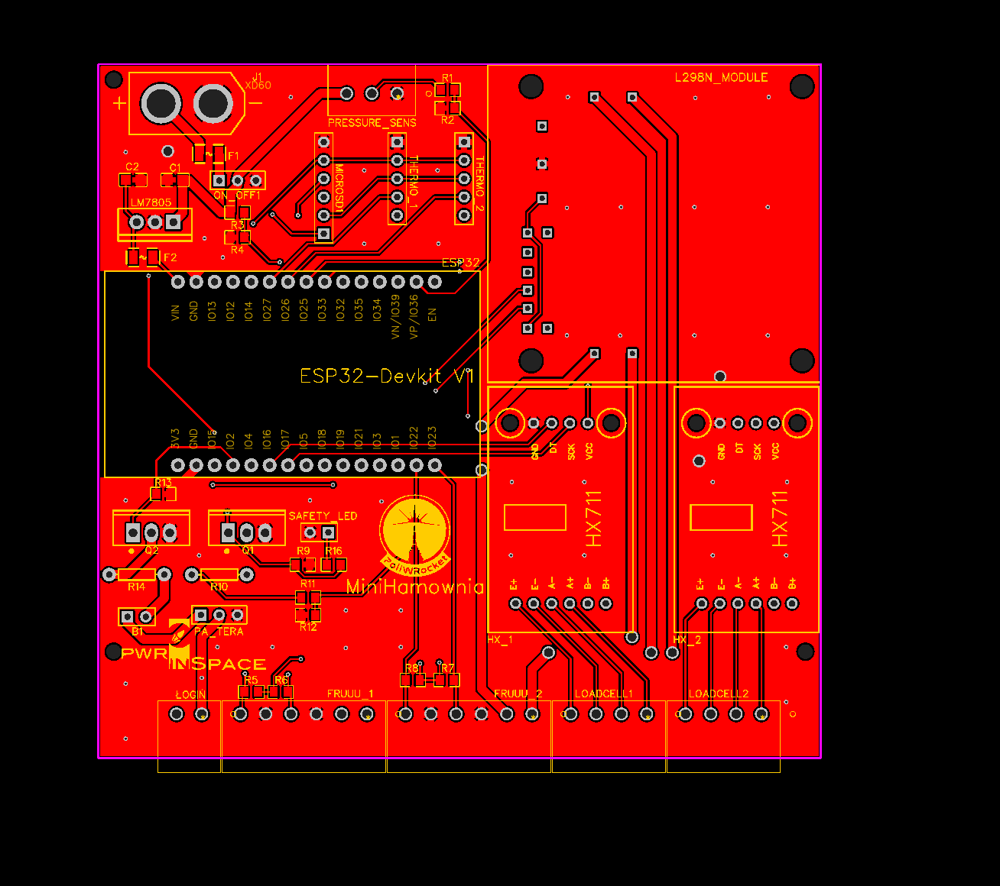
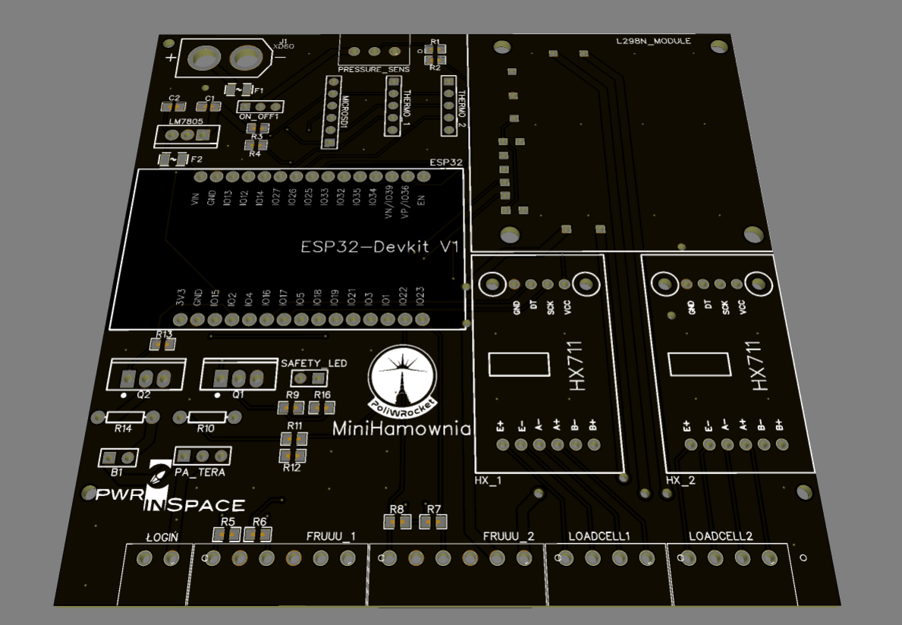

# MiniHamowniav2

This is the main repository for the SRAD static fire station electronics module developed by PWr in Space Science Club of Wrocław University of Science and Technology.

## ESP32 platform

Built in the Arduino framework (PlatformIO) with active use of FreeRTOS, on the ESP32 platform. Allows for:
```
    1. A fully remote static fire test of a solid/hybrid/liquid rocket motor with the help of built in ESP32 Bluetooth.
    2. Thrust and oxidizer weight measurements during the test.
    3. Temperature measurement
    4. DC motors/servo(optional) control for valves
```
### Class diagram

TBD

### RToS tasks

TBD

### States

TBD

## The main computing board

Below you can see the PCB layout and render of the main computing board for the module.


